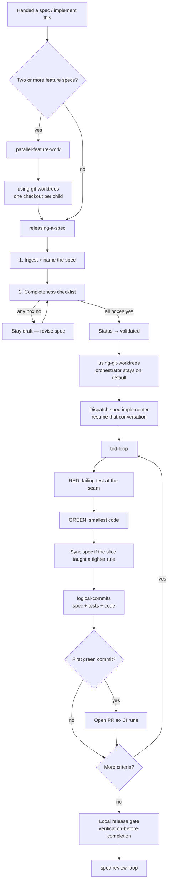
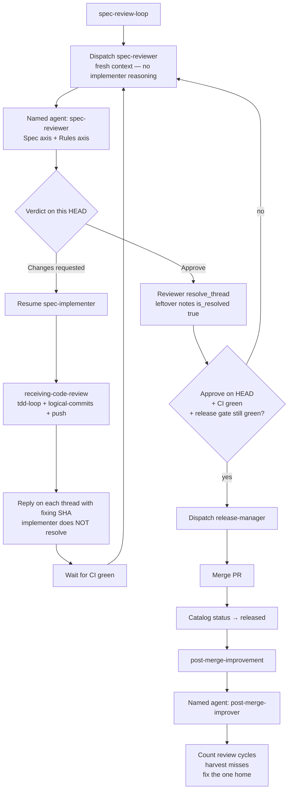
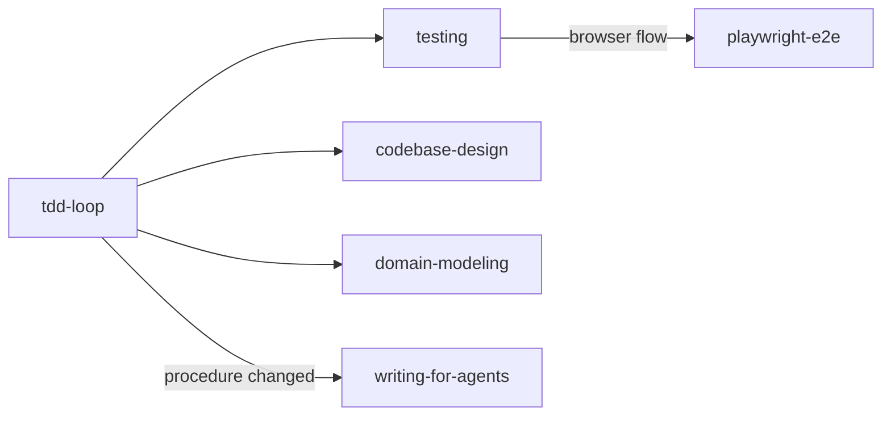
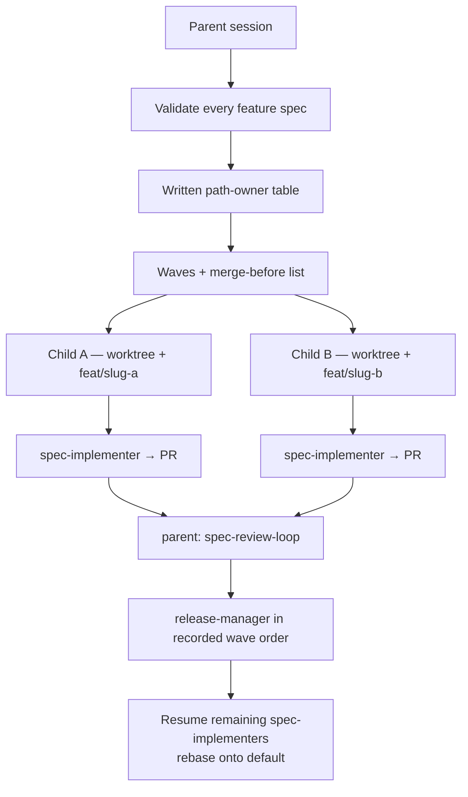

# spec-loop

Portable **spec-first agent workflow**: skills, named agents, and a spec-tree starter.

Copy it into a product repo. The **orchestrator** validates a spec, then dispatches a `spec-implementer` (all coding), a fresh `spec-reviewer`, and a `release-manager` (merge). Same implementer conversation is resumed for that spec until it ships. The orchestrator does not write production code.

It is not a framework, a hosted service, or a stack. The product still owns its architecture, UI kit, telemetry, and domain rules.

## What you get

| Piece | Purpose |
|-------|---------|
| **Skills** (`.agents/skills/`) | Procedures the working agent loads: specs, TDD, commits, CI, review, tests, modules |
| **Named agents** (`.agents/agents/`) | Resume `spec-implementer` per spec; fresh `spec-reviewer`, `release-manager`, `post-merge-improver` each dispatch |
| **Always-on** (`AGENTS.md`) | Iron laws + skill index. Fill in the product one-liner |
| **Spec tree** | `CONTEXT.md` stub, spec catalog, feature template, ADR home |

## Install

Clone this repository, then copy these paths into the product. Do **not** copy this README over the app's README.

```sh
git clone git@github.com:lonnylot/spec-loop.git
APP=/path/to/your-app

cp spec-loop/AGENTS.md "$APP/"
cp spec-loop/CONTEXT.md "$APP/"
cp -R spec-loop/.agents "$APP/"
mkdir -p "$APP/docs/specs/features" "$APP/docs/adr"
cp spec-loop/docs/specs/README.md "$APP/docs/specs/"
cp spec-loop/docs/specs/features/_TEMPLATE.md "$APP/docs/specs/features/"
cp spec-loop/docs/adr/README.md "$APP/docs/adr/"
```

Then in the product:

1. Replace the `{product}` placeholder in `AGENTS.md` with a one-sentence outcome.
2. Add the first domain terms to `CONTEXT.md`.
3. Point the coding agent at repo-root `AGENTS.md` (this pack is harness-agnostic).

Updates are manual: pull this repo and copy again, or cherry-pick files. Product-specific sediment (weaker-fixture catalogs, stack placement) belongs in the product, not here.

## Iron law

```
NO BEHAVIOR WITHOUT A SPEC.
NO CODE CHANGE WITHOUT THE MATCHING SPEC UPDATE IN THE SAME COMMIT.
NO FEATURE WORK ON THE DEFAULT BRANCH.
NO SHIP UNTIL CI IS GREEN, A SEPARATE REVIEWER APPROVES THIS HEAD, AND THE RELEASE GATE IS CLEAN.
```

Spec status: `draft` → `validated` → `released`. Only `validated` specs may be implemented. Only `released` specs may be called done.

## End-to-end workflow

Always-on rules in `AGENTS.md` sit around the whole thing. `keeping-specs-current` wraps every behavior change. `verification-before-completion` wraps every "green / done / released" claim.



## Review, merge, learn



## Inside one criterion

These attach to the slice when that kind of work is in the criterion. They are not extra stages.



## Parallel work



## Who does what

| Role | Skills / agents | Does |
|------|-----------------|------|
| Orchestrator | `releasing-a-spec`, `spec-review-loop` | Validate the spec with the user. Dispatch and resume agents. Does not write production code or merge |
| `spec-implementer` | named agent | TDD, commits, PR, review fixes. One spec, one worktree, one conversation to resume |
| `spec-reviewer` | named agent | Read spec + diff, comment, Approve or Changes requested. Fresh context every dispatch. Does not implement |
| `release-manager` | named agent | Merge after the four holds. Catalog `released`. Review-cycle count. Does not implement or review |
| `post-merge-improver` | named agent | After merge, tighten skills/specs so the same miss cannot recur |

## Skills

Load the matching skill **before** the work.

### Process spine

| Skill | Reach for it when |
|-------|-------------------|
| `keeping-specs-current` | Any behavior change; suspected spec drift; leftover UI/Events/Assumptions after restating an AC |
| `releasing-a-spec` | Handed a spec to implement, validate, or ship; dispatch spec-implementer |
| `writing-for-agents` | Editing `AGENTS.md`, skills, or named agents; a spec changed a procedure |
| `tdd-loop` | Implementing or fixing; before production code |
| `logical-commits` | A criterion is green; deciding whether / what to commit |
| `github-ci-loop` | Starting work; branching; opening a PR; waiting on CI; unmergeable PR |
| `spec-review-loop` | PR exists; resume implementer for review fixes; dispatch release-manager |
| `receiving-code-review` | Reviewer or human left comments |
| `post-merge-improvement` | PR just merged; learn from review into skills/docs |
| `verification-before-completion` | About to claim done, green, fixed, or released |
| `parallel-feature-work` | Two or more feature specs at once |
| `using-git-worktrees` | Dispatch spec-implementer; isolated checkout |

### Engineering

| Skill | Reach for it when |
|-------|-------------------|
| `testing` | Placing tests, choosing seams, mapping criteria, catching a weaker-reading fixture |
| `playwright-e2e` | Browser user flows, flow CI job, test-server fakes |
| `codebase-design` | Module shape, seam, adapter, depth |
| `domain-modeling` | New or conflicting domain term; `CONTEXT.md`; ADR |

## Named agents

| Agent | Context | Does |
|-------|---------|------|
| `spec-implementer` | **Resume** the same conversation for one spec | Implements criteria, opens the PR, addresses review. Does not review or merge |
| `spec-reviewer` | **Fresh** every dispatch | Reviews the diff against the spec and `AGENTS.md`. Posts comments. Does not implement |
| `release-manager` | **Fresh** | Merges after the four holds. Sets spec `released`. Does not implement or review |
| `post-merge-improver` | **Fresh** | After merge: harvest misses, one-home skill/spec fixes |

## Spec tree

| Kind | Path | Owns |
|------|------|------|
| Ubiquitous language | `CONTEXT.md` | Domain terms only. No implementation |
| Spec catalog | `docs/specs/README.md` | Index + status of every spec |
| Feature specs | `docs/specs/features/<slug>.md` | One vertical slice. Template: `_TEMPLATE.md` |
| Hard decisions | `docs/adr/NNNN-slug.md` | Irreversible trade-offs only |
| Procedures | `.agents/skills/*/SKILL.md` | How to write, test, review, and release |
| Named agents | `.agents/agents/*/AGENT.md` | Resume `spec-implementer` per spec; fresh `spec-reviewer`, `release-manager`, `post-merge-improver` |

Product-specific system specs (architecture, business rules, design inventory, observability) live in the product when that product has them. This pack does not ship those files.

Environment (`package.json`, CI workflows, lockfiles) owns installed versions and script names. Specs and skills do not cache them.

## Out of this pack

Stack placement, UI kit, telemetry vendor, and domain rules. Add product skills for those (for example `architecture-and-framework`, `design-system`, `event-logging`) and point to them from the product `AGENTS.md`.
